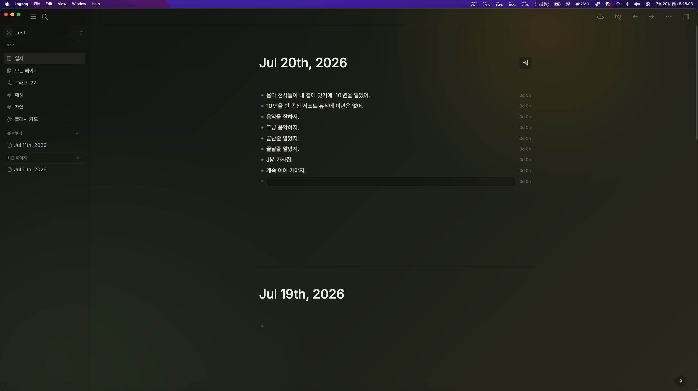
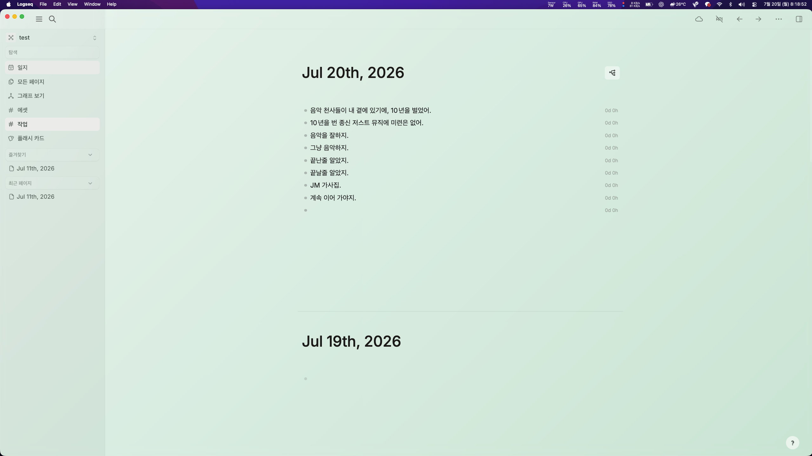

# Logseq Transparent
  

A translucent glass theme for **Logseq DB 2.0+** with balanced dark and light
appearances.

Logseq Transparent gives the Logseq interface a calm, layered look while
preserving the structure and readability of the native DB interface. It styles
the main workspace, navigation, sidebars, blocks, properties, tables, dialogs,
notifications, and other DB views.

## Preview

### Dark



### Light



## Features

- Matching dark and light theme variants
- Translucent surfaces with soft gradients and restrained blur
- Coordinated navigation, sidebar, editor, dialog, and notification styling
- DB view styling for properties, tables, galleries, and query builders
- Responsive layout and reduced-motion support
- No remote fonts, trackers, or images required at runtime

## Installation

### Logseq Marketplace

1. Open **Plugins** in Logseq.
2. Select **Marketplace**, then open the **Themes** category.
3. Search for **Logseq Transparent** and install it.
4. Open **Settings → Themes**.
5. Select **Logseq Transparent Light** or **Logseq Transparent Dark**.

### Manual installation

1. Download and extract the latest release archive.
2. Open **Plugins** in Logseq.
3. Open the plugin menu and select **Load unpacked plugin**.
4. Select the extracted theme folder.
5. Open **Settings → Themes** and select the light or dark variant.

## Usage

Choose the variant that matches your Logseq appearance:

- **Logseq Transparent Dark** for dark appearance
- **Logseq Transparent Light** for light appearance

The theme follows Logseq's active selection color for links, controls, and
other accent states. Change the selection color in Logseq to update the theme's
accent color.

## Custom background

You can override the public `--lt-*` variables in Logseq's
**Settings → Edit custom.css**. For example:

```css
html:root {
  --lt-wallpaper:
    linear-gradient(rgba(9, 20, 17, 0.2), rgba(9, 20, 17, 0.2)),
    url("file:///Users/you/Pictures/wallpaper.jpg");
  --lt-wallpaper-blur: 8px;
  --lt-wallpaper-position: center;
}
```

Use a local `file:///` URL for personal background images. A complete example
is available in [`custom-background.example.css`](./custom-background.example.css).

## Compatibility

- Logseq DB 2.0 or later
- macOS, Windows, and Linux desktop applications
- Light and dark appearances

Third-party plugins may require additional styling because their interfaces are
not standardized by Logseq.

## Inspiration

Logseq Transparent is inspired by
[`oczko24/Obsidian-transparent`](https://github.com/oczko24/Obsidian-transparent),
particularly its transparent gradient surfaces and layered interface
composition.

This is an independent Logseq theme and does not include CSS from the original
project.

## License

Released under the [GNU General Public License v3.0](./LICENSE).
